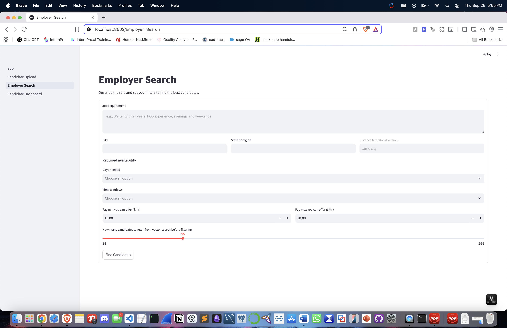

# Insta-Hire Local 🧑‍💼🤝

A Streamlit-based local hiring app that helps **candidates** upload resumes and **employers** search for the best matches using embeddings and filtering (city, availability, pay).  
Everything runs locally with SQLite + ChromaDB, so it’s lightweight and easy to test.

---

## 🚀 Features

### Candidate Upload
- Upload PDF resumes
- Provide name, contact details, location, availability, and pay expectations
- Resume text is automatically parsed, embedded, and stored in ChromaDB

---

### Employer Search
- Employers enter a job description
- Filter candidates by city, state, availability, and pay range
- Matches are ranked by semantic similarity + pay proximity
- Preview resume snippets and download PDFs

---

### Candidate Dashboard
- View all uploaded candidates in one place
- Check availability, pay expectations, and stored resumes

---

### Example Search in Action
- Employer searches for **“bartender in Tempe, AZ available Tue night”**
- System returns the best-matched candidate ranked #1

---

## 🛠 Tech Stack

- **Frontend / UI**: [Streamlit](https://streamlit.io)
- **Database**: SQLite (via SQLAlchemy)
- **Vector Store**: [ChromaDB](https://www.trychroma.com/)
- **Embeddings**: [SentenceTransformers](https://www.sbert.net/)
- **PDF Parsing**: PyPDF2

---

Notes

Resumes are stored locally in /data/resumes.

Embeddings are stored in /data/chroma.

The database is /data/app.db.

You can reset everything by deleting data/ and re-running uploads.

